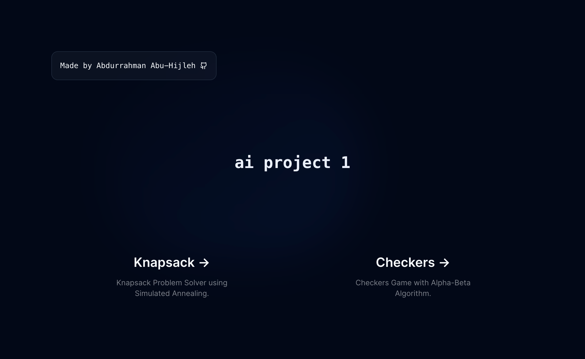
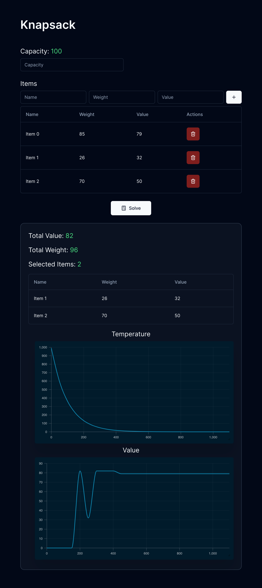
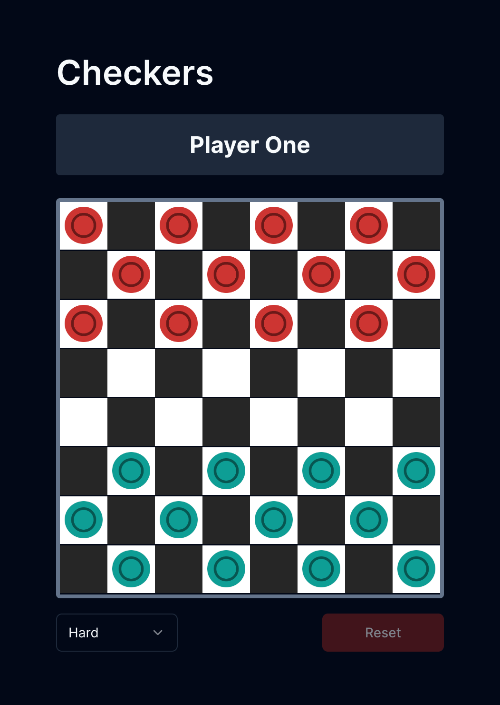

# ai project 1

Project for NNU Artificial Intelligence course



## ✨ Features

- Knapsack Problem Solver using Simulated Annealing
- 🚧 Checkers Game with Alpha-Beta Algorithm _(Still a work in progress)_

## ⚡ How to use?

### 🔌 Prerequisites

- Install [Node.js](https://nodejs.org/en/) on your machine

### 📦 Commands

```shell
# install dependencies
$ npm install

# run development server
$ npm run dev
```

## 💰 Knapsack Problem Solver



### File Structure

```shell
src/app/knapsack
├── components
│   ├── charts.tsx
│   └── data-table.tsx
├── constants
│   ├── columns.tsx
│   └── data.ts
├── layout.ts
├── logic.ts
├── page.tsx
└── types.ts
```

| File/Directory | Purpose                         | Description                                                                                                                                          |
| -------------- | ------------------------------- | ---------------------------------------------------------------------------------------------------------------------------------------------------- |
| `components/`  | UI Components                   | - `charts.tsx`: Renders various charts to visualize simulated annealing progress.<br>- `data-table.tsx`: Displays data in a structured table format. |
| `constants/`   | Constant Definitions            | - `columns.tsx`: Defines the structure for table columns.<br>- `data.ts`: Contains static data utilized throughout the application.                  |
| `layout.ts`    | Page Layout Configuration       | Used to add page metadata such as title and description tags.                                                                                        |
| `logic.ts`     | Business Logic Implementation   | Implements the knapsack problem solution using the simulated technique.                                                                              |
| `page.tsx`     | Main Application Interface      | Hosts the GUI of the app.                                                                                                                            |
| `types.ts`     | Type Definitions and Interfaces | Contains type definitions and interfaces used across the application, centralizing the app's data typing.                                            |

### Problem Representation

```ts
export type Knapsack = {
  capacity: number;
  items: Item[];
};

export type Item = {
  name: string;
  weight: number;
  value: number;
};
```

### Pseudocode

```plaintext
Function SolveKnapsack:
    Input: initialState (Knapsack), initialTemp (number), minTemp (number), alpha (number)
    Output: Solution

    1. Validate the input initialState
    2. Set currentSolution to initialState
    3. Set bestSolution to currentSolution
    4. Set temperature to initialTemp

    5. While true:
        a. Multiply the temperature by alpha (cooling schedule: lower the probability of accepting a worse solution)
        b. Generate newSolution as a random successor of currentSolution
        c. Calculate deltaE as the difference in objective function values between newSolution and currentSolution

        d. If deltaE is positive (newSolution is better than currentSolution):
            i. Update currentSolution to newSolution
            ii. If objective function value of bestSolution is less than that of currentSolution:
                - Update bestSolution to currentSolution

        e. Else if the probability (exp(deltaE / temperature)) is greater than a random number (newSolution is worse than currentSolution but we can accept it):
            i. Update currentSolution to newSolution

        f. If temperature drops below or equals minTemp:
            - Break the loop

    6. Return bestSolution

End Function
```

## 🎲 Checkers

> 🚧 Still a work in progress



## 🌟 Credits

- Used [React Checkers](https://github.com/GabrielMioni/react-checkers) for the checkers game user interface
